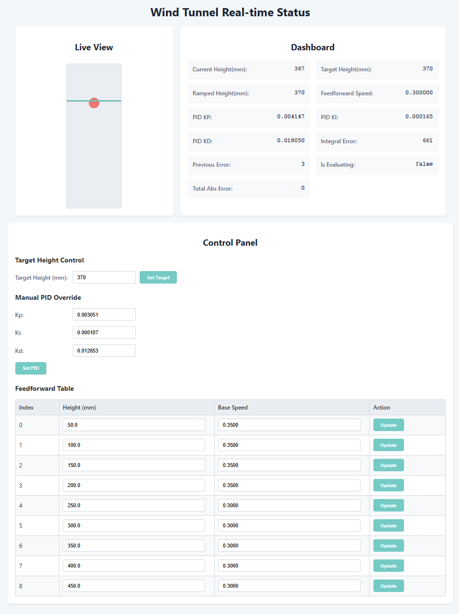

# 基于RT-Thread的风洞悬浮球控制简单实践

## 1. 项目简介

本项目是一个基于 **RT-Thread** 操作系统和 **NXP FRDM-MCXA156** 开发板的风洞悬浮球控制系统。系统通过 `VL53L0X` ToF激光测距传感器实时检测乒乓球的高度，并采用简单的 **PID + 前馈 + 增益调度** 控制算法，控制 `YS4028B12H` PWM风扇的转速，从而实现乒乓球在设定高度的稳定悬浮。

此外，项目还包含一个 `SSD1306` OLED屏幕用于实时数据显示，并通过 `RW007` Wi-Fi模块和Python WebSocket代理，实现了一个Web前端，允许用户在浏览器上远程监控系统状态和调整目标高度。

## 2. 功能特性

*   **高度控制:** 采用简单PID + 前馈 + 增益调度的控制算法，适应不同高度下的系统非线性特性。
*   **实时数据显示:** 板载OLED屏幕实时显示当前高度和目标高度。
*   **Web远程监控:** 通过Wi-Fi和WebSocket技术，在Web页面上实时展示系统状态图表，并可远程设置目标高度。
*   **多线程架构:** 基于RT-Thread的多线程架构，将控制、显示、通信等任务解耦，保证系统实时性和稳定性。
*   **命令行调试:** 集成RT-Thread FinSH/MSH，可通过串口或远程TCP连接进行参数调整和状态查询。

## 3. 硬件连接

| 组件 | 开发板引脚 | 连接方式 |
| :--- | :--- | :--- |
| **PWM风扇 (YS4028B12H)** | `P3_6` | 连接到 `FLEXPWM0_A0`，用于PWM调速 |
| **ToF传感器 (VL53L0X)** | `P0_22` (SCL), `P0_23` (SDA) | 软件I2C总线 (在使用硬件I2C时这个传感器总是初始化失败) |
| **OLED屏幕 (SSD1306)** | `P1_9` (SCL), `P1_8` (SDA) | 硬件I2C总线 (`LPI2C2`) |
| **Wi-Fi模块 (RW007)** | (SPI) | 连接到 `LPSPI1` |
| **调试串口** | `P0_2` (RX), `P0_3` (TX) | 连接到 `LPUART0` |
| **工作指示灯** | `P3_12` | GPIO输出 |

## 4. 软件架构

系统软件分为两部分：运行在MCXA156上的RT-Thread嵌入式固件，和运行在PC上的Python WebSocket代理服务器。

**工作流程:**

1.  **数据采集:** `主控制线程` 通过I2C读取 `VL53L0X` 传感器的高度数据。
2.  **控制计算:** 线程根据当前高度和目标高度，通过PID、前馈和增益调度算法计算出最终的风扇转速。
3.  **执行输出:** `主控制线程` 调用PWM驱动，更新风扇转速。
4.  **本地显示:** `OLED显示线程` 读取全局变量中的高度信息，并刷新屏幕。
5.  **远程通信:**
    *   PC端的 `websocket_proxy.py` 脚本连接到设备的TCP端口（MSH/FinSH）。
    *   脚本定期发送 `get_status` 命令获取系统状态，并将返回的JSON数据通过WebSocket发送给Web浏览器。
    *   用户在Web端的操作被转换成命令（如 `pid_tune -t 300`），通过WebSocket发送给Python脚本，最终由脚本转发给设备执行。

## 5. 构建、烧录与运行

### 5.1 构建固件

本项目使用 `scons` 进行构建。

```bash
# 编译
scons -j12

# 清理工程
scons --clean
```

### 5.2 烧录固件

使用 `pyocd` 工具进行烧录。请确保已正确安装pyocd并连接好调试器。

```bash
pyocd flash rtthread.bin
```

### 5.3 运行Web监控

1.  **配置Wi-Fi:** 固件启动后，通过串口进入FinSH/MSH命令行，使用 `wifi join` 命令连接到你的Wi-Fi网络。设备IP地址将显示在日志中（例如 `192.168.0.105`）。

2.  **修改代理脚本:** 打开 `applications/remote/websocket_proxy.py` 文件，将 `TCP_SERVER_IP` 修改为你的设备IP地址。

    ```python
    # 板子的TCP服务器地址和端口
    TCP_SERVER_IP = "你的设备IP地址" # 例如 "192.168.0.105"
    TCP_SERVER_PORT = 5000
    ```

3.  **安装依赖并运行:**

    ```bash
    # 安装依赖
    pip install websockets

    # 运行代理服务器
    python applications/remote/websocket_proxy.py
    ```

4.  **打开Web页面:** 在浏览器中打开 `applications/HTML/index.html` 文件，即可看到实时数据图表并进行控制。

## 6. 使用说明

*   **本地交互:** 通过串口工具连接到开发板，波特率为 `115200`。可以使用 `help` 查看所有可用命令。
*   **远程交互:** 启动Web服务后，可以看到当前系统的状态信息以及控制面板
    