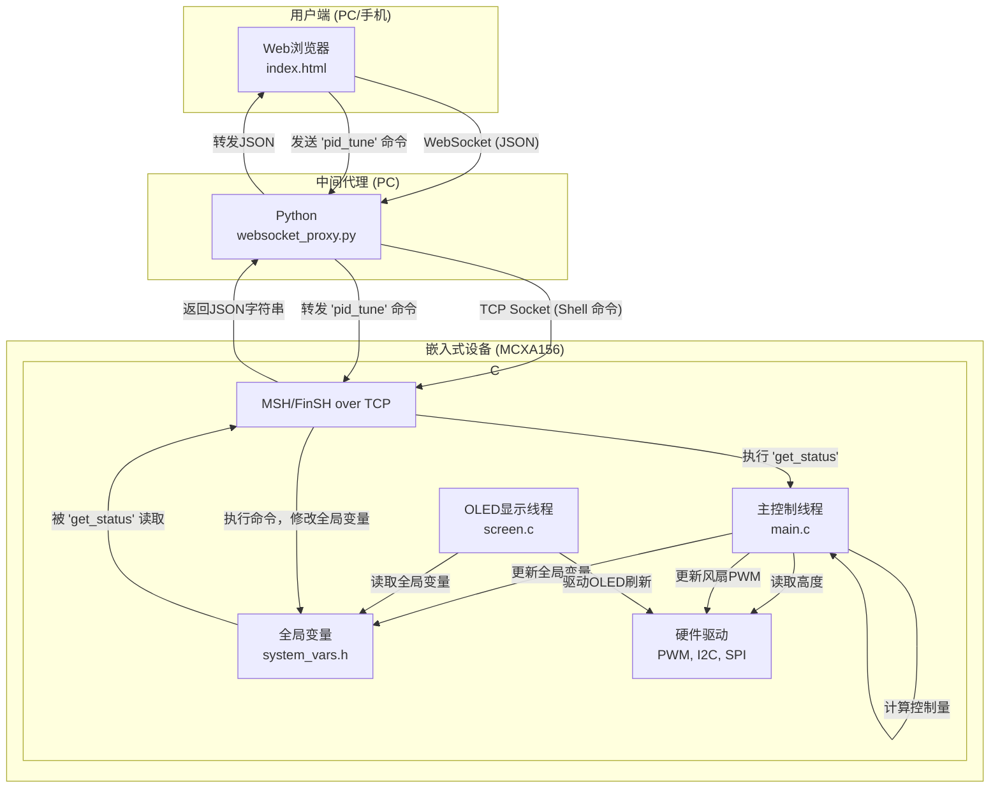
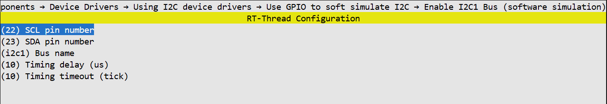

# 风洞悬浮球：基于RT-Thread与MCXA156的简单控制实践

## 一、项目概述

本项目基于 **RT-Thread实时操作系统** 和 **NXP FRDM-MCXA156** 开发板，构建了一个能够将乒乓球稳定悬浮在预定高度的控制系统。配备了本地数据显示屏和远程Web监控界面，构成了一个功能相对完整的嵌入式系统。

**项目核心功能：**

*   **精确的高度测量：** 通过 `VL53L0X` ToF激光测距传感器，系统能够以毫米级精度实时获取乒乓球的高度。
*   **复合控制算法：** 考虑到管道内风的非线性特性，我没有采用单一的PID控制器，而是使用简单的 **PID + 前馈 + 增益调度** 的复合控制策略，以适应不同目标高度下的系统动态变化。
*   **多任务并发处理：** 基于RT-Thread的多线程架构，将核心控制、OLED显示、网络通信等任务分离到不同的线程中，确保了控制任务的实时性不受其他功能影响。
*   **远程监控与人机交互：** 系统通过 `RW007` Wi-Fi模块接入局域网，并借助一个Python WebSocket代理，将数据实时推送到Web前端。用户可以在浏览器上观察高度、目标等参数的实时曲线，并可远程下发指令，调整悬浮的目标高度。

本文将详细剖析该系统的硬件选型、软件架构、核心算法实现以及开发过程中遇到的挑战与解决方案，希望能为对嵌入式控制系统感兴趣的开发者提供一些参考和启发。


---

## 二、硬件选型与连接

### 2.0 材料准备

管道：亚克力管子（外径50mm 厚度2mm 内孔46mm 长50cm ）

出风口罩：随便找一个饮料瓶，剪掉上半，底部戳几个洞，罩在管道一侧，用于稳定管道末端风速并防止小球飞出

风扇：pwm 4线风扇（12v18000转 4线）

降压稳压模块：12v转5v，要有12v输出和5v输出，注意共地

### 2.1 核心控制器：NXP FRDM-MCXA156

*   **性能：** 搭载 ARM Cortex-M33 内核，主频高达 96MHz，为复杂的控制算法和多线程应用提供了充足的算力。
*   **外设：** 内置多个 I2C, SPI, PWM, UART 等接口，可以轻松连接本项目所需的各种外设，无需额外的扩展板。
*   **生态：** NXP官方提供了完善的SDK和文档支持，同时RT-Thread也对其有良好的适配，大大降低了开发门槛。

### 2.2 各功能模块

| 组件 | 型号 | 作用 | 选型理由 |
| :--- | :--- | :--- | :--- |
| **高度传感器** | `VL53L0X` | ToF激光测距 | 提供毫米级、高频率的距离测量，不受环境光干扰，是本项目精确控制的基础。 |
| **执行器 (风扇)** | `YS4028B12H` | 产生上升气流 | 4028尺寸的暴力风扇，支持PWM调速，能够提供足够大的风量来托起乒乓球。 |
| **显示屏** | `SSD1306` | 128x64 OLED | I2C接口，功耗低，体积小，方便在本地实时显示关键数据，便于调试。 |
| **Wi-Fi模块** | `RW007` | 网络通信 | RT-Thread生态中常见的Wi-Fi模块，驱动成熟，可以方便地让设备接入网络。 |

### 2.3 硬件连接详情

所有模块与 **FRDM-MCXA156** 开发板的连接如下表所示。

| 组件 | 开发板引脚 | 备注 |
| :--- | :--- | :--- |
| **PWM风扇 (YS4028B12H)** | `P3_6` | 连接到 `FLEXPWM0_A0`，用于PWM调速 |
| **ToF传感器 (VL53L0X)** | `P0_22` (SCL), `P0_23` (SDA),`P2_0`(XSHUT) | 软件I2C总线和开关控制 |
| **OLED屏幕 (SSD1306)** | `P1_9` (SCL), `P1_8` (SDA) | 硬件I2C总线 (`LPI2C2`)，配置参考[SSD1306配置](https://www.rt-thread.org/document/site/#/rt-thread-version/rt-thread-standard/tutorial/make-bsp/MCX-A156/%E6%81%A9%E6%99%BA%E6%B5%A6FRDM-MCXA156%E5%AE%9E%E8%B7%B5%E6%8C%87%E5%8D%97?id=%e5%8d%81%e4%b8%80%e3%80%81%e6%81%a9%e6%99%ba%e6%b5%a6a156%e4%b8%8a%e7%9a%84iic%e7%a1%ac%e4%bb%b6%e5%ae%9e%e8%b7%b5%e7%82%b9%e7%81%af%e5%a4%a7%e5%b8%88) |
| **Wi-Fi模块 (RW007)** | (SPI) | 连接到 `LPSPI1`，配置参考[rw007配置](https://www.rt-thread.org/document/site/#/rt-thread-version/rt-thread-standard/tutorial/make-bsp/MCX-A156/%E6%81%A9%E6%99%BA%E6%B5%A6FRDM-MCXA156%E5%AE%9E%E8%B7%B5%E6%8C%87%E5%8D%97?id=%e4%ba%8c%e3%80%81%e6%81%a9%e6%99%ba%e6%b5%a6a156%e4%b8%8a%e7%9a%84rw007%e5%ae%9e%e8%b7%b5%e8%91%a3%e7%ad%96) |
| **调试串口** | `P0_2` (RX), `P0_3` (TX) | 连接到 `LPUART0` |
| **工作指示灯** | `P3_12` | GPIO输出 |


---

## 三、软件架构设计

本项目的软件核心是运行在MCXA156上的RT-Thread嵌入式固件，它与PC端的Python代理脚本和Web前端共同构成一个完整的监控系统。

### 3.1 整体架构图

下图清晰地展示了系统的三个主要部分（嵌入式设备、中间代理、用户端）以及它们之间的数据流和交互关系。



### 3.2 工作流程详解

1.  **数据采集与控制 (主控制线程):** 系统核心，该线程以 `20ms` 的周期运行，在每个周期内：
    *   通过I2C总线读取 `VL53L0X` 传感器的高度数据。
    *   根据当前高度和斜坡化的目标高度，执行 **PID + 前馈 + 增益调度** 算法，计算出最终的风扇PWM占空比（转速）。
    *   调用PWM驱动，更新风扇转速。
    *   将当前高度、目标高度等状态信息写入全局变量，供其他线程使用。
2.  **本地显示 (OLED显示线程):** 该线程独立于主控制循环，它定期从全局变量中读取最新的系统状态，并将其格式化后显示在 `SSD1306` 屏幕上。
3.  **远程通信 (Websocket代理):**
    *   PC上运行的 `websocket_proxy.py` 脚本一方面通过TCP连接到设备的TCP服务器，另一方面启动一个WebSocket服务等待Web浏览器的连接。代理脚本定期向设备发送 `get_status` 命令，设备执行该命令后，会返回一个包含所有状态信息的JSON字符串。脚本解析此字符串，并通过WebSocket将其推送给前端。

---

## 四、 VL53L0X配置

可以直接使用vl53l0x这个软件包。

### 4.1 软件包的启用与配置

1. **启用软件包**：在 `RT-Thread online packages ---> peripheral libraries and drivers ---> sensors drivers --->` 中，勾选 `[*] VL53L0X Time of flight(TOF) sensor.`。

2. **sensor_v1驱动**：勾选 `[*] Enable sensor_v1 divce framework` 并启用sample。

3. **配置I2C总线**：使用软件I2C，配置如下
   

4. **修改一下sample**：

   ```c
   MSH_CMD_EXPORT(read_distance_sample, read distance sample);
   
   static int rt_hw_vl53l0x_port(void)
   {
       struct rt_sensor_config cfg;
       	
   	cfg.intf.dev_name = "i2c1"; 		/* i2c bus */
       cfg.intf.user_data = (void *)0x29;	/* i2c slave addr */
       rt_hw_vl53l0x_init("vl53l0x", &cfg, 64);/* xshutdown ctrl pin */
   
       return RT_EOK;
   }
   INIT_COMPONENT_EXPORT(rt_hw_vl53l0x_port);
   
   // 在vl53l0x_sensor_v1.c中
   #define	VL53L0X_I2C_BUS			"i2c1"		/* i2c linked */
   ```

### 4.2 应用层调用

配置完成后，`VL53L0X` 传感器就被注册为RT-Thread系统中一个名为 `tof_vl53l0x` 的标准设备（要把RT_NAME_MAX改大一点才能显示完全）。在 `main.c` 中，我们只需通过标准设备接口即可与之交互，代码非常简洁：

```c
/* --- main.c --- */

// 1. 查找并打开设备
rt_device_t tof_dev = rt_device_find("tof_vl53l0x");
rt_device_open(tof_dev, RT_DEVICE_FLAG_RDONLY);

// 2. 在主循环中读取数据
struct rt_sensor_data sensor_data;
rt_size_t res = rt_device_read(tof_dev, 0, &sensor_data, 1);

// 3. 获取毫米为单位的距离值
current_height = sensor_data.data.proximity;
```


---

## 五、风扇控制 (PWM)

参考Servo_sg90库，改一改就能用，当然也可以直接操作pwm

### 5.1 引脚配置

```c
    /* PORT3_6 (pin 71) is configured as PWM0_A0 */
    PORT_SetPinMux(PORT3, 6U, kPORT_MuxAlt5);

    PORT3->PCR[6] = ((PORT3->PCR[6] &
                      /* Mask bits to zero which are setting */
                      (~(PORT_PCR_IBE_MASK)))

                     /* Input Buffer Enable: Enables. */
                     | PORT_PCR_IBE(PCR_IBE_ibe1));
    /* PORT3_8 (pin 69) is configured as PWM0_A1 */
    PORT_SetPinMux(PORT3, 8U, kPORT_MuxAlt5);

    PORT3->PCR[8] = ((PORT3->PCR[8] &
                      /* Mask bits to zero which are setting */
                      (~(PORT_PCR_IBE_MASK)))

                     /* Input Buffer Enable: Enables. */
                     | PORT_PCR_IBE(PCR_IBE_ibe1));
```

### 5.2 核心实现

驱动的核心在于 `ys4028b12h_set_speed` 函数：

```c
/* --- applications/fan/YS4028B12H.c --- */

rt_err_t ys4028b12h_set_speed(ys4028b12h_cfg_t cfg, float speed)
{
    // ... 省略参数检查 ...

    // 核心逻辑：根据速度百分比计算脉冲宽度值
    cfg->pulse = (int)(cfg->period * speed); 
    
    // 调用RT-Thread底层PWM API进行设置
    rt_pwm_set(cfg->name, cfg->channel, cfg->period, cfg->pulse);

    return RT_EOK;
}
```

在 `main.c` 的主控制循环中，只需调用这个高层API即可：

```c
/* --- main.c --- */

// ... PID计算之后 ...
float final_fan_speed = ff_speed + pid_output;

// ... 限幅之后 ...
ys4028b12h_set_speed(cfg, final_fan_speed);
```

便于维护和拓展


---

## 六、控制算法

考虑到风洞系统是一个典型的非线性系统（在不同高度，维持悬浮所需的风力变化并非线性），单一的PID控制器难以在整个高度范围（50mm ~ 450mm）内都取得良好效果。因此，本项目采用了一套简单的复合控制策略。

### 6.1 复合控制策略概览

我们的控制算法主要由以下四个部分组成，它们在 `main.c` 的主控制循环中协同工作：

1.  **设定值斜坡 (Ramped Setpoint):** 变更高度时让目标高度缓慢变化，避免目标高度突变带来的系统剧烈震荡。
2.  **增益调度 (Gain Scheduling):** 根据当前目标高度，动态调整PID参数（Kp, Ki, Kd），以适应系统的非线性。
3.  **前馈控制 (Feed-forward):** 引入一个基础风速，作为PID控制的“预补偿”，加快系统响应。
4.  **PID闭环控制:** 经典的比例-积分-微分控制器，用于消除系统的稳态误差。

### 6.2 代码实现

#### 1. 设定值斜坡

当用户设置一个新的 `target_height` 时，我们不直接将其作为PID控制器的目标，而是引入一个中间变量 `ramped_height`，让它以固定的步长 `RAMP_STEP` 逐渐逼近最终目标。

```c
/* --- main.c --- */
// 每一次变化的步长
#define RAMP_STEP 0.5f
// 最终目标值由用户设定
float target_height = 250.0f; 
// PID控制器当前追踪的、平滑变化的目标
float ramped_height = 250.0f; 

// 在主循环中
if (FABS(ramped_height - target_height) > RAMP_STEP) {
    if (ramped_height < target_height) ramped_height += RAMP_STEP;
    else ramped_height -= RAMP_STEP;
    // 当追踪目标变化时，需要同步更新PID增益
    update_pid_gains_by_target(ramped_height);
} else {
    ramped_height = target_height;
}
```
这样做可以有效防止因目标值瞬间变化过大而导致的超调和震荡。

#### 2. 增益调度与前馈

增益调度和前馈都基于预先测定好的查找表。在 `main.c` 中，我们定义了 `gain_schedule_table` 和 `ff_table`。

*   `gain_schedule_table`: 存储了不同高度下，经过优化的PID参数组。
*   `ff_table`: 存储了不同高度下，一个大致能让球悬浮的基础风速（事实上，很难找，找到一个缓慢上升的速度就可以了）。

`update_pid_gains_by_target()` 和 `get_feedforward_speed()` 函数会根据当前的 `ramped_height`，通过**线性插值**的方式，从查找表中计算出最合适的 `Kp, Ki, Kd` 和基础风速 `ff_speed`。

```c
/* --- main.c: update_pid_gains_by_target() 伪代码 --- */

// 1. 找到目标高度所在的区间
lower_bound = find_closest_lower_entry(target);
upper_bound = find_closest_upper_entry(target);

// 2. 计算插值比例
ratio = (target - lower_bound.height) / (upper_bound.height - lower_bound.height);

// 3. 线性插值计算出当前高度对应的Kp, Ki, Kd
KP = lower_bound.kp + ratio * (upper_bound.kp - lower_bound.kp);
KI = lower_bound.ki + ratio * (upper_bound.ki - lower_bound.ki);
KD = lower_bound.kd + ratio * (upper_bound.kd - lower_bound.kd);
```
#### 3. PID核心计算与输出

最后，我们将前馈控制量与PID控制器的输出量相加，得到最终的风扇速度。

```c
/* --- main.c: 主控制循环核心 --- */

// PID 控制器核心计算
float error = ramped_height - (float)current_height;
integral_error += error;
float derivative_error = error - previous_error;
float pid_output = (KP * error) + (KI * integral_error) + (KD * derivative_error);
previous_error = error;

// 前馈与PID输出合并
float ff_speed = get_feedforward_speed(ramped_height);
float final_fan_speed = ff_speed + pid_output;

// 输出限幅与积分抗饱和
if (final_fan_speed > 1.0f) {
    final_fan_speed = 1.0f;
    integral_error -= error; // 抗饱和：当输出饱和时，减去本次积分量
}
if (final_fan_speed < 0.0f) {
    final_fan_speed = 0.0f;
    integral_error -= error; // 抗饱和
}

// 设置风扇速度
ys4028b12h_set_speed(cfg, final_fan_speed);
```
当计算出的 `final_fan_speed` 超出物理限制（`>1.0` 或 `<0.0`）时，我们会从积分项 `integral_error` 中减去（或加上）本次的误差。这可以防止积分项在输出饱和期间无限制地累积，从而避免了在系统恢复时可能出现的巨大超调。


---

## 七、远程监控

为了让控制过程可视化，并能远程干预，本项目设计了一套基于Web的远程监控系统。其核心思想是：**在设备端运行一个自定义的TCP应用层协议服务器，并通过一个PC端的Python脚本作为代理，将TCP协议转换成Web前端通用的WebSocket协议。**

### 7.1 设备端：自定义TCP服务器 (`remote.c`)

参考network_samples，我在设备端实现了一个简单的TCP服务器（[`applications/remote/remote.c`](applications/remote/remote.c)），它监听在5000端口。这个服务器的功能非常专一，只响应两个核心命令：

1.  **`get_status`**: 当收到此命令时，服务器会立即读取系统中所有相关的全局变量（如当前高度、目标高度、PID参数等），将它们打包成一个JSON字符串，然后发送给客户端。
2.  **`pid_tune`**: 当收到此命令（例如 `pid_tune -t 300`）时，服务器会直接调用已有的 `pid_tune()` MSH函数，从而实现对系统参数的修改。

```c
/* --- applications/remote/remote.c: 命令分发伪代码 --- */

// ... 接收并解析命令 ...
if (strcmp(argv[0], "get_status") == 0)
{
    // 打包JSON并发送
    sprintf(send_buf, "{\"current_height\":%ld, ... }", current_height, ...);
    send(connected, send_buf, ...);
}
else if (strcmp(argv[0], "pid_tune") == 0)
{
    // 直接调用MSH函数
    pid_tune(argc, argv);
    send(connected, "OK\r\n", ...);
}
```

这里复用了为串口命令行调试而编写的 `pid_tune` 函数，避免了重复开发。

### 7.2 中间代理：WebSocket协议转换器 (`websocket_proxy.py`)

浏览器无法直接访问TCP端口，但它能很好地支持WebSocket。因此，我们需要一个中间人来进行协议转换。[`applications/remote/websocket_proxy.py`](applications/remote/websocket_proxy.py) 脚本就扮演了这个角色。

它使用Python的 `asyncio` 和 `websockets` 库，同时维护两类连接：

*   **一个到设备TCP服务器的持久连接**：
    *   它会定期（每100ms）自动发送 `get_status` 命令来拉取最新数据。
    *   当从TCP连接收到设备返回的JSON数据后，它会立即将这些数据**广播**给所有连接到它的WebSocket客户端。
*   **多个来自Web浏览器的WebSocket连接**：
    *   当从任何一个WebSocket客户端收到命令时（如用户在网页上调整了目标高度），它会将这条命令原封不动地通过TCP连接转发给设备。

```python
# --- applications/remote/websocket_proxy.py: 核心逻辑伪代码 ---

# 任务一：定期请求状态
async def request_status_periodically():
    while True:
        tcp_writer.write(b"get_status\r\n")
        await asyncio.sleep(0.1)

# 任务二：处理TCP收到的数据
async def tcp_communication_manager():
    while True:
        message = await tcp_reader.read()
        # 如果是JSON数据
        if is_json(message):
            # 广播给所有WebSocket客户端
            for client in clients:
                await client.send(message)

# 任务三：处理WebSocket客户端发来的命令
async def handle_websocket_client(websocket):
    async for command in websocket:
        # 直接转发给TCP服务器
        tcp_writer.write(command.encode())
```

*   **解耦**：设备端无需关心复杂的WebSocket协议，只需实现简单的TCP通信。Web前端也无需关心设备的IP地址和端口，只需连接到代理服务器。
*   **广播能力**：代理可以轻松地将一份数据广播给多个监控端，实现多人同时监控。
*   **灵活性**：未来如果想增加新的功能，例如数据存储、历史记录分析等，都可以在代理层实现，而无需修改嵌入式固件。


---

## 八、OLED数据显示

除了远程监控，本项目还集成了一块 `SSD1306` OLED屏幕，用于在设备端实时显示关键信息。

### 8.1 显示线程

为了不影响核心控制逻辑的实时性，要将OLED的刷新任务放在一个独立的线程中。

```c
/* --- main.c --- */
screen_thread = rt_thread_create("ScreenUpdate", screen_on, RT_NULL, 1280, 11, 20);
rt_thread_startup(screen_thread);
```

`screen_on` 函数（位于 [`applications/OLED/screen.c`](applications/OLED/screen.c)）是这个线程的实体。它与主控制线程是**并发**执行的。

### 8.2 通过全局变量进行线程间通信

我创建了一个头文件 [`applications/system_vars.h`](applications/system_vars.h)，在其中使用 `extern` 关键字声明了所有需要在线程间共享的变量。

```c
/* --- applications/system_vars.h --- */
#ifndef SYSTEM_VARS_H
#define SYSTEM_VARS_H

// ...
extern int32_t current_height;
extern float target_height;
// ...

#endif
```

*   **主控制线程**作为**生产者**，在每次循环的最后，会更新这些全局变量的值。
*   **OLED显示线程**作为**消费者**，它只需包含 `system_vars.h` 这个头文件，就可以直接访问这些变量的最新值。

```c
/* --- applications/OLED/screen.c --- */
#include <system_vars.h> // 包含全局变量声明

void screen_on()
{
    // ... u8g2初始化 ...
    while (1)
    {
        // 直接读取全局变量
        sprintf(buf, "Current: %d", current_height);
        u8g2_DrawStr(&u8g2, 10, 18, buf);
        sprintf(buf, "Target: %d", (int)target_height);
        u8g2_DrawStr(&u8g2, 10, 36, buf);
        
        u8g2_SendBuffer(&u8g2);
        rt_thread_mdelay(500); // 降低刷新率，避免闪烁
    }
}
```

这种**“生产者-消费者”**模式，通过共享内存（全局变量）进行通信，是一种简单高效的线程间数据交换方式。对于本项目这种数据关系简单、实时性要求不极端的场景来说，是一个非常合适的选择。


---

## 九、有待改进的地方

1.**传感器的I2C问题**： `VL53L0X` 传感器在连接到MCXA156的硬件I2C总线时，始终无法被正确初始化，会卡在一个叫`VL53L0X_device_read_strobe`的函数上，尝试次数超过2000，然后返回错误。排查了连线问题，也确认了I2C引脚配置了（SSD1306可以正常使用），找不出来，发现使用软件i2c没问题就摆了。

2.**控制精度**：因为控制算法比较简单，而且PWM风扇对PWM占空比的响应也不是完全线性的（阶梯式的），加之管道内的风流比较复杂，所以小球在悬浮时最大会有10mm左右的上下波动，无法做到让小球精确的悬浮在指定的高度。

3.**控制算法优化**：目前的PID参数和前馈表是通过手动试凑和简单的评估脚本（贝叶斯优化）得到的。未来可以引入更高级的系统辨识方法（如基于MATLAB的System Identification Toolbox）来建立更精确的数学模型，或采用在线自动整定算法（如Ziegler-Nichols或继电反馈法）来自动优化参数。

4.**增加鲁棒性**：可以增加对传感器数据异常值的滤波处理（如卡尔曼滤波），以应对乒乓球快速晃动或偶尔的测量噪声。

5.**功能扩展**：可以增加更复杂的控制模式，例如轨迹跟踪（让球按照预设的正弦曲线上下运动），这将对控制算法提出更高的要求。

希望本文的分享，能为同样走在嵌入式开发道路上的朋友们提供一些有价值的参考。

---

## 十、项目源码

*   **GitHub仓库地址：** `https://github.com/Cylopsis/Little-Wind-Tunnel` 

欢迎大家Fork，并提出宝贵的意见和建议。
